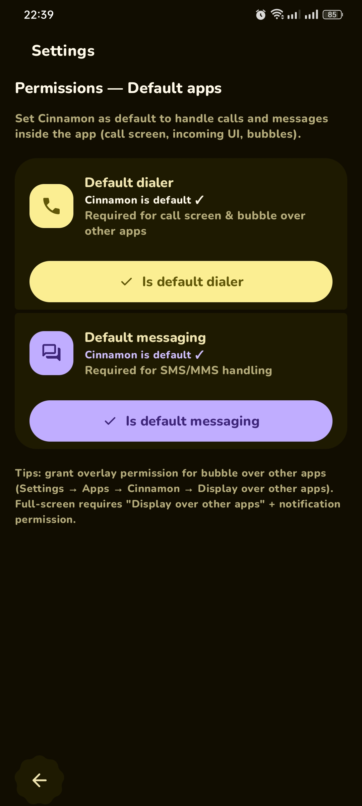
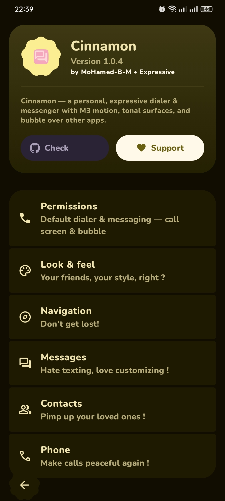
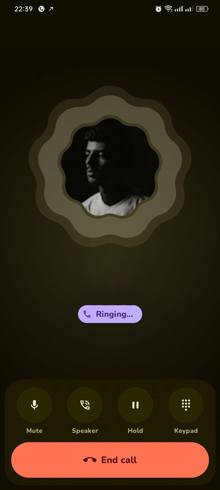
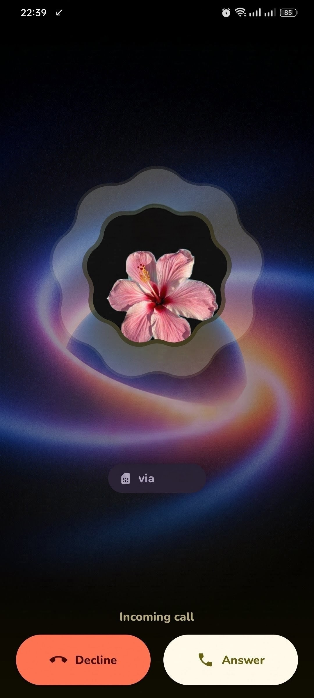

# Changelog

  
  
  
  

## [1.0.5] - 2026-09-02

### Features
- feat(call): add M3 Expressive call screens with tonal surfaces and squircle shapes by @MoHamed-B-M in 004a961
- feat(call): add call bubble overlay with blur over other apps by @MoHamed-B-M in c6d4e93
- feat(call): add incoming call full-screen popup toggle by @MoHamed-B-M in bbf1215
- feat(settings): add Permissions screen with default dialer and SMS cards by @MoHamed-B-M in f44fd04
- feat(settings): move incoming popup to Look & Feel and add blur toggles by @MoHamed-B-M in ba67614
- feat(dialer): make full dialer with InCallService and screening by @MoHamed-B-M in ea431ca
- feat(about): redesign about card with expressive tonal design by @MoHamed-B-M in dc3fecf
- feat(icons): update call and message icons by @MoHamed-B-M in f44fd04

### Fixes
- fix(call): ensure call button opens Cinnamon CallScreen instead of system dialer by @MoHamed-B-M in f8e0409
- fix(call): remove default-dialer gating so all calls open in app by @MoHamed-B-M in 254449d
- fix(call): make end call button work with fallback ENDED state by @MoHamed-B-M in ea431ca
- fix(call): keep SIM chooser inside Cinnamon with first-handle fallback by @MoHamed-B-M in ea431ca
- fix(call): restore CallScreen Haze provider closing braces by @MoHamed-B-M in 58cc40f
- fix(call): remove Haze blur from call screen per request by @MoHamed-B-M in dc3fecf
- fix(call): fix CallScreen syntax error expecting top level declaration by @MoHamed-B-M in 8a7edab
- fix(settings): make default dialer launcher work without NEW_TASK flag by @MoHamed-B-M in bbf1215
- fix(settings): handle phone settings crash for null SIM and permissions by @MoHamed-B-M in ba67614
- fix(navigation): restore Messages/Contacts/Dialer navigation from haze delegate bug by @MoHamed-B-M in ba67614
- fix(settings): make SwitchSettingsCard toggle correctly without it param by @MoHamed-B-M in 0e32214
- fix(settings): remove swipe to delete toggle and fix unresolved reference by @MoHamed-B-M in dc3fecf
- fix(messages): make swipe to delete setting scrollable and add missing size import by @MoHamed-B-M in d51f981
- fix(messages): remove swipe to delete per request by @MoHamed-B-M in dc3fecf
- fix(messages): fix crash when opening conversation with empty participants by @MoHamed-B-M in 08045ed

### Chores
- chore(release): add ephemeral beta preview and stable release workflows with keystore signing by @MoHamed-B-M in 004a961
- chore(blur): remove blur function for nav bar, search bar, and call screen per request by @MoHamed-B-M in dc3fecf
- chore(swipe): remove swipe to delete per request by @MoHamed-B-M in dc3fecf

---

### 👥 Contributors
- **MoHamed-B-M** — [@MoHamed-B-M](https://github.com/MoHamed-B-M)

